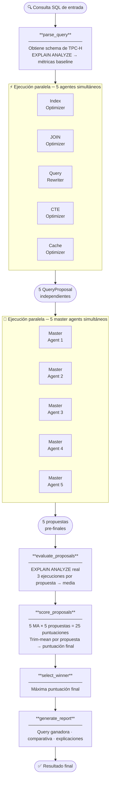
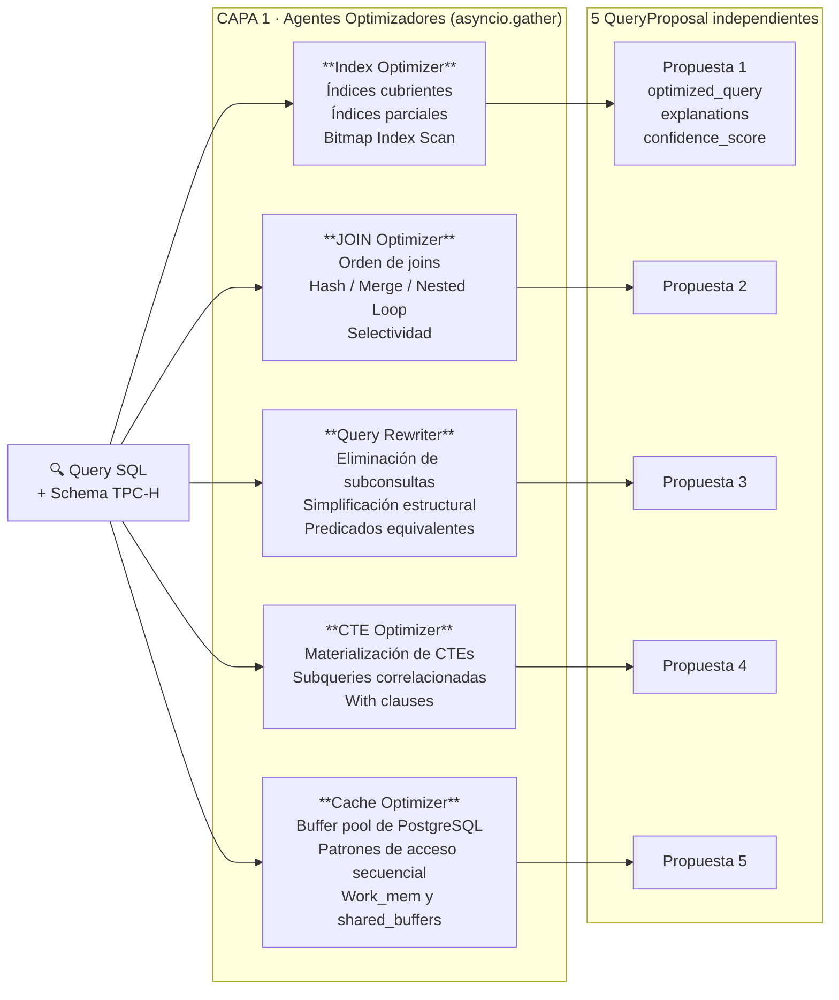
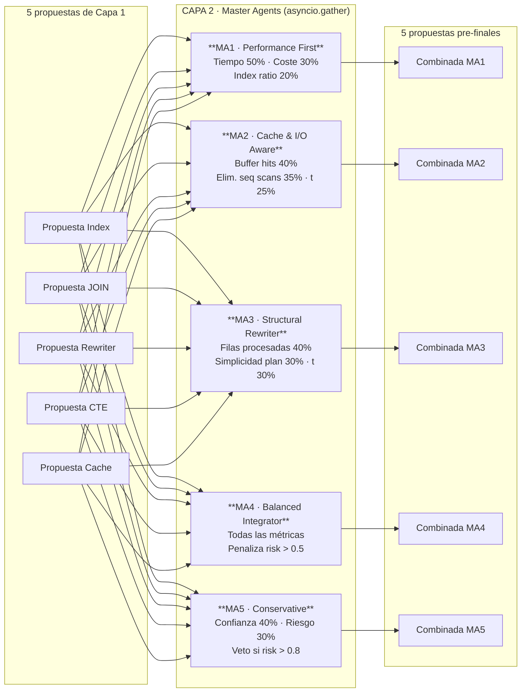
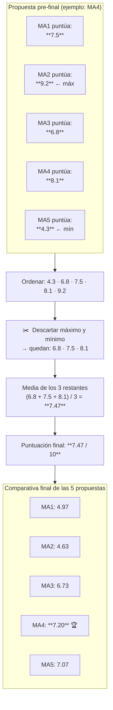
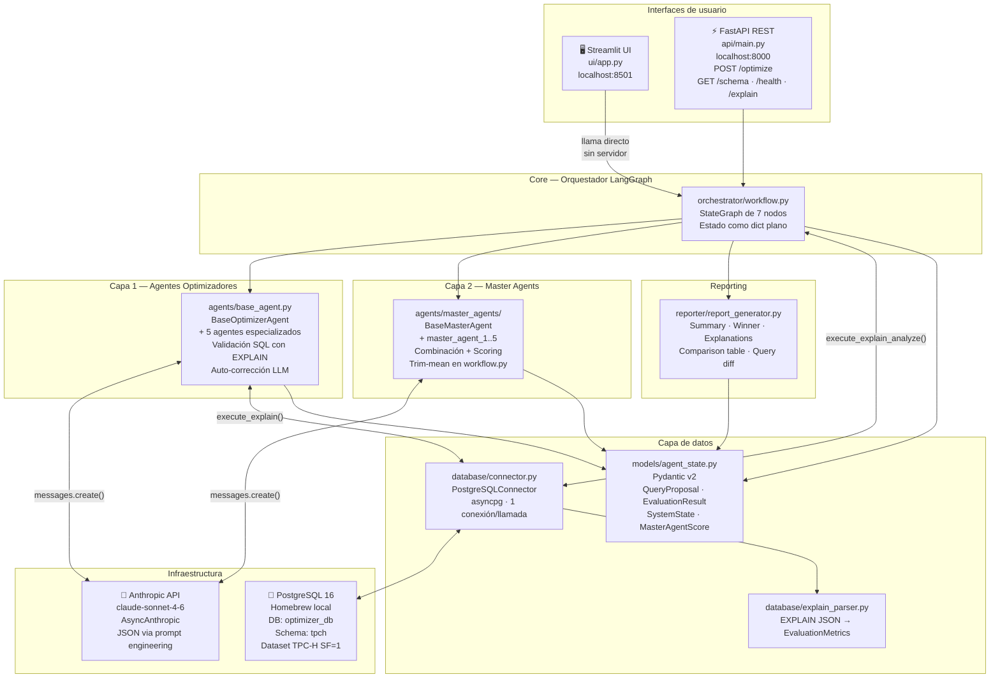

# Sistema Multiagente para la Optimización de Consultas SQL en PostgreSQL

**TFG — Universidad Nebrija · Escuela Politécnica Superior**

> Diseño e implementación de un sistema multiagente capaz de generar, evaluar y comparar distintas estrategias de optimización de consultas SQL en el entorno de PostgreSQL. Cada agente está especializado en un criterio concreto y compite para producir la versión más eficiente de una consulta dada.

---

## Tabla de contenidos

1. [Descripción general](#descripción-general)
2. [Diagrama de flujo del pipeline](#diagrama-de-flujo-del-pipeline)
3. [Diagrama del sistema de agentes](#diagrama-del-sistema-de-agentes)
4. [Sistema de puntuación Trim-mean](#sistema-de-puntuación-trim-mean)
5. [Arquitectura de componentes](#arquitectura-de-componentes)
6. [Requisitos previos](#requisitos-previos)
7. [Instalación](#instalación)
8. [Configuración](#configuración)
9. [Uso](#uso)
10. [Cómo funciona por dentro](#cómo-funciona-por-dentro)
11. [Tests](#tests)
12. [Estructura del proyecto](#estructura-del-proyecto)

---

## Descripción general

El sistema recibe una consulta SQL arbitraria y devuelve la versión optimizada con mayor puntuación, junto con un informe detallado que explica qué cambios se han aplicado, por qué, y qué mejora de rendimiento se espera.

El flujo completo pasa por **dos capas de agentes LLM** (10 agentes en total) más **medición real con EXPLAIN ANALYZE** contra una instancia PostgreSQL 16 con el dataset TPC-H (escala SF=1: ~600K filas en `lineitem`, ~150K en `orders`, ~15K en `customer`).

---

## Diagrama de flujo del pipeline

El orquestador es un grafo LangGraph de 7 nodos. El estado completo (`SystemState`) fluye entre nodos como un diccionario plano.



---

## Diagrama del sistema de agentes

### Capa 1 — Agentes Optimizadores Especializados

Cada agente recibe la query original + schema y produce una propuesta de optimización independiente.



### Capa 2 — Master Agents

Cada Master Agent recibe las 5 propuestas, las combina según su estrategia y produce una propuesta pre-final propia.



---

## Sistema de puntuación Trim-mean

Tras la evaluación real con `EXPLAIN ANALYZE`, los 5 Master Agents puntúan **cada una** de las 5 propuestas pre-finales (25 llamadas LLM en total). La puntuación final de cada propuesta es la **media recortada** (trim-mean): se descartan la puntuación más alta y la más baja, y se hace la media de las 3 restantes.



---

## Arquitectura de componentes



---

## Requisitos previos

- **Python 3.11+**
- **PostgreSQL 16** instalado localmente vía Homebrew (`brew install postgresql@16`)
- Una **ANTHROPIC_API_KEY** activa ([console.anthropic.com](https://console.anthropic.com))

> ⚠️ El sistema no usa Docker. Requiere una instancia local de PostgreSQL 16 con el dataset TPC-H cargado.

---

## Instalación

```bash
# 1. Clonar el repositorio
git clone https://github.com/GCardaba/entrega_parcial_memoriaEmpresa.git
cd entrega_parcial_memoriaEmpresa

# 2. Crear entorno virtual e instalar dependencias
python3 -m venv venv
venv/bin/pip install -r requirements.txt

# 3. Iniciar PostgreSQL
brew services start postgresql@16

# 4. Crear base de datos y usuario
psql postgres -c "CREATE USER optimizer_admin WITH PASSWORD 'practicas';"
psql postgres -c "CREATE DATABASE optimizer_db OWNER optimizer_admin;"
psql optimizer_db -c "CREATE SCHEMA tpch AUTHORIZATION optimizer_admin;"

# 5. Cargar el dataset TPC-H
#    (Los CSVs deben estar disponibles en tpch/data/ o generarse con tpch-dbgen)
psql -U optimizer_admin -d optimizer_db -f database/setup.py
```

---

## Configuración

Crea un fichero `.env` en la raíz del proyecto (existe `.env.example` como plantilla):

```env
# Anthropic Claude API
ANTHROPIC_API_KEY=sk-ant-...

# PostgreSQL
DB_HOST=localhost
DB_PORT=5432
DB_NAME=optimizer_db
DB_USER=optimizer_admin
DB_PASSWORD=practicas
DB_SCHEMA=tpch
```

---

## Uso

### Interfaz web (recomendado)

```bash
venv/bin/streamlit run ui/app.py
```

Abre `http://localhost:8501`. Desde la UI puedes:

- Seleccionar una query de ejemplo (JOIN simple, subconsulta correlacionada, TPC-H Q1)
- Escribir tu propia consulta SQL
- Configurar la conexión a PostgreSQL y la API key desde la barra lateral
- Ver el resultado en 4 pestañas: query optimizada con diff, tabla comparativa de agentes, explicaciones por técnica, y JSON raw del informe

### API REST

```bash
venv/bin/uvicorn api.main:app --reload --port 8000
```

```bash
# Optimizar una query
curl -X POST http://localhost:8000/optimize \
  -H "Content-Type: application/json" \
  -d '{"sql_query": "SELECT c.c_name, SUM(o.o_totalprice) FROM tpch.customer c JOIN tpch.orders o ON c.c_custkey = o.o_custkey WHERE c.c_mktsegment = '\''BUILDING'\'' GROUP BY c.c_name LIMIT 10"}'

# Obtener el schema de TPC-H
curl http://localhost:8000/schema

# EXPLAIN ANALYZE de una query
curl -X POST http://localhost:8000/explain \
  -H "Content-Type: application/json" \
  -d '{"query": "SELECT * FROM tpch.orders LIMIT 10"}'
```

La respuesta del endpoint `/optimize` contiene:

```json
{
  "session_id": "...",
  "status": "done",
  "report": {
    "summary": "The winning query (from master_4) achieves a +20.6% execution time change...",
    "winner": {
      "agent_id": "master_4",
      "optimized_query": "SELECT ...",
      "optimization_strategy": "...",
      "confidence_score": 0.83,
      "final_score": 7.20,
      "metrics": { "actual_time_ms": 26.2, "total_cost": 5298.3, "seq_scans": 1, "index_scans": 1 }
    },
    "explanations": [
      {
        "technique": "Partial Covering Index on customer",
        "reason": "Eliminates heap fetches for BUILDING segment",
        "expected_benefit": "Reduces I/O by 60-70%",
        "risk_factor": 0.1,
        "limitations": ["Index maintenance on INSERT/UPDATE"]
      }
    ],
    "comparison_table": [
      { "rank": 1, "agent_id": "master_4", "final_score": 7.20, "actual_time_ms": 26.2, "time_improvement_pct": 20.6 }
    ]
  }
}
```

---

## Cómo funciona por dentro

### Validación de SQL

Antes de proponer cualquier query optimizada, el sistema la valida con `EXPLAIN` (sin `ANALYZE`). Si falla, le pide al LLM que la corrija una vez. Si vuelve a fallar, devuelve la query original sin cambios.

### Prompts en inglés

Todos los prompts del sistema están escritos en inglés para maximizar la consistencia y calidad de las respuestas del LLM, independientemente del idioma de la consulta.

### Límites de rate de la API

El tier gratuito de Anthropic tiene un límite de 30.000 tokens/minuto. La fase de puntuación (25 llamadas: 5 evaluaciones × 5 master agents) se ejecuta secuencialmente para no superarlo. Con una cuenta de pago este límite desaparece y puede paralelizarse.

### Métricas de evaluación

Se extraen del JSON de `EXPLAIN ANALYZE FORMAT JSON` de PostgreSQL 16:

| Métrica | Fuente en el JSON |
|---------|--------|
| `actual_time_ms` | `root["Execution Time"]` (nivel raíz) |
| `total_cost` | `Plan.Total Cost` del nodo raíz |
| `buffer_hits` | Suma de `Shared Hit Blocks` en todos los nodos |
| `seq_scans` | Conteo de nodos `Seq Scan` |
| `index_scans` | Conteo de `Index Scan` + `Index Only Scan` + `Bitmap Index Scan` |

---

## Tests

```bash
# Suite completa (49 tests, ~7s)
venv/bin/python -m pytest tests/ -v

# Un fichero concreto
venv/bin/python -m pytest tests/test_explain_parser.py -v

# Un test por nombre
venv/bin/python -m pytest tests/test_agents.py::test_invalid_llm_output_falls_back_to_original -v
```

| Fichero | Tipo | Requiere BD |
|---------|------|-------------|
| `test_explain_parser.py` | Unitario | No (usa fixture JSON capturado) |
| `test_connector.py` | Integración | Sí |
| `test_agents.py` | Unitario + integración | Sí (validación de sintaxis SQL) |
| `test_scoring_system.py` | Unitario | No |
| `test_workflow.py` | Integración | Sí |

---

## Estructura del proyecto

```
├── agents/
│   ├── base_agent.py            # BaseOptimizerAgent: LLM call, parsing, validación SQL
│   ├── index_agent.py
│   ├── join_agent.py
│   ├── rewrite_agent.py
│   ├── cte_agent.py
│   ├── cache_agent.py
│   └── master_agents/
│       ├── base_master_agent.py # BaseMasterAgent: combine + score + _parse_json
│       ├── master_agent_1..5.py # Estrategias diferenciadas
│       └── scoring_system.py    # Trim-mean
├── database/
│   ├── connector.py             # PostgreSQLConnector (asyncpg)
│   └── explain_parser.py        # EXPLAIN JSON → EvaluationMetrics
├── models/
│   └── agent_state.py           # Pydantic v2: QueryProposal, EvaluationResult, SystemState…
├── orchestrator/
│   └── workflow.py              # LangGraph StateGraph(dict), 7 nodos
├── reporter/
│   └── report_generator.py      # Dict final: summary, winner, comparison_table
├── api/
│   └── main.py                  # FastAPI: POST /optimize, GET /schema · /health · /explain
├── ui/
│   └── app.py                   # Streamlit UI (llama al workflow directamente)
├── tests/
│   └── conftest.py              # MockLLM (forma Anthropic), fixtures TPC-H
├── config/
│   └── settings.py              # Variables de entorno centralizadas
├── .env.example
├── requirements.txt
├── pytest.ini                   # asyncio_mode = auto
└── CLAUDE.md                    # Guía para Claude Code
```

---

*TFG · Gabriel Cárdaba López · Universidad Nebrija 2025*
